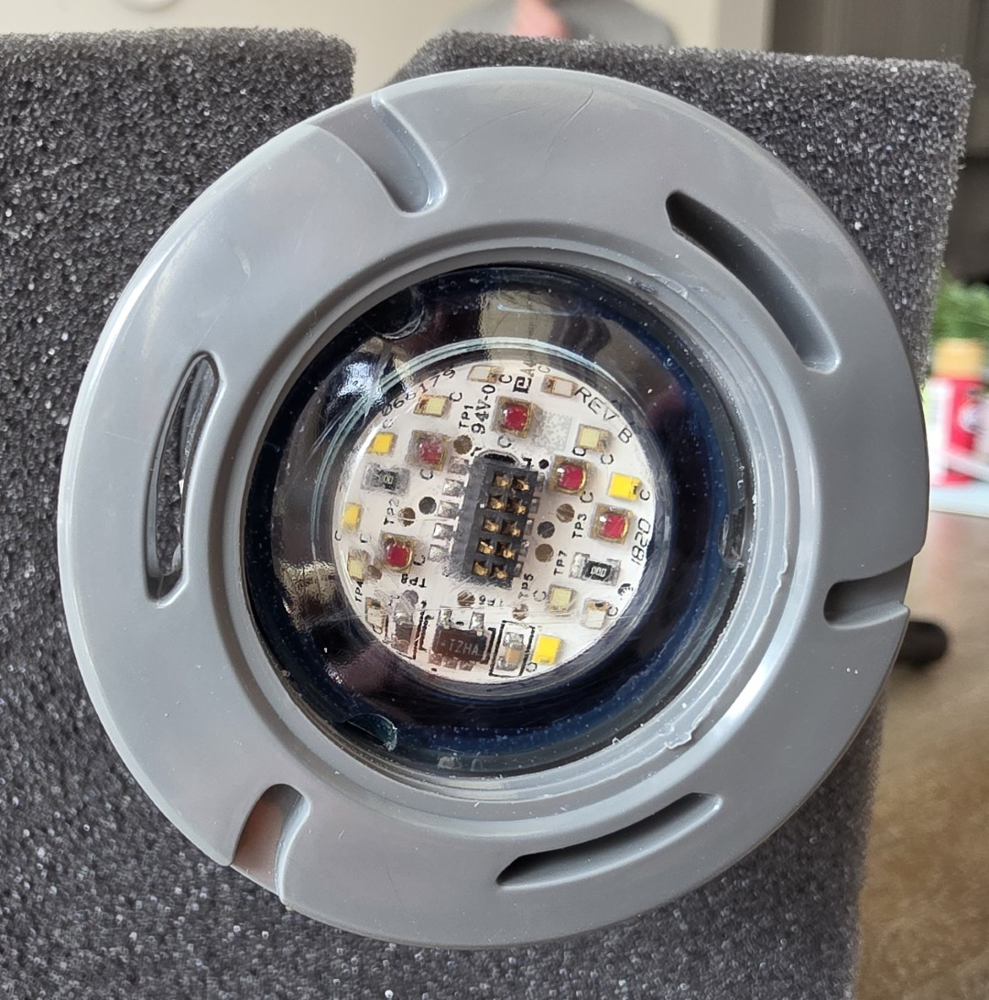
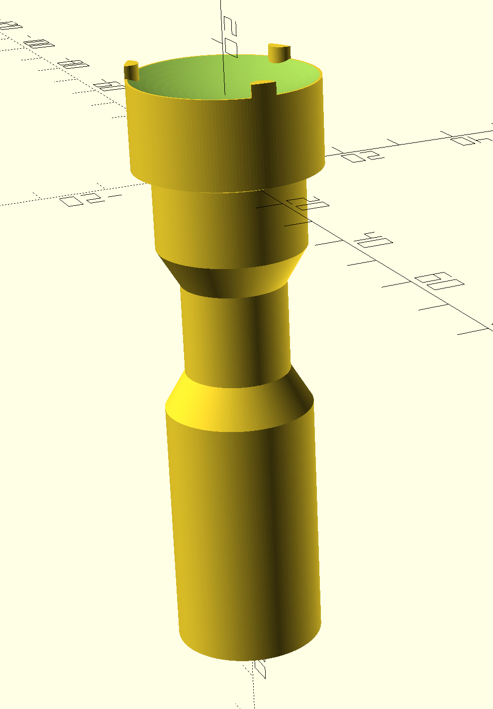
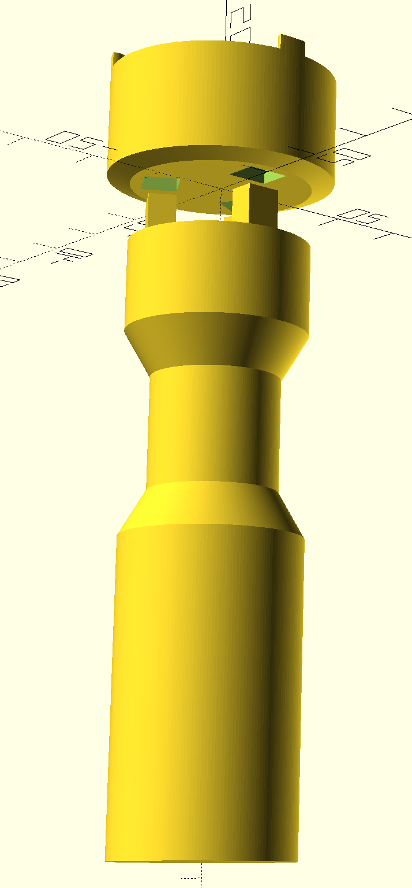
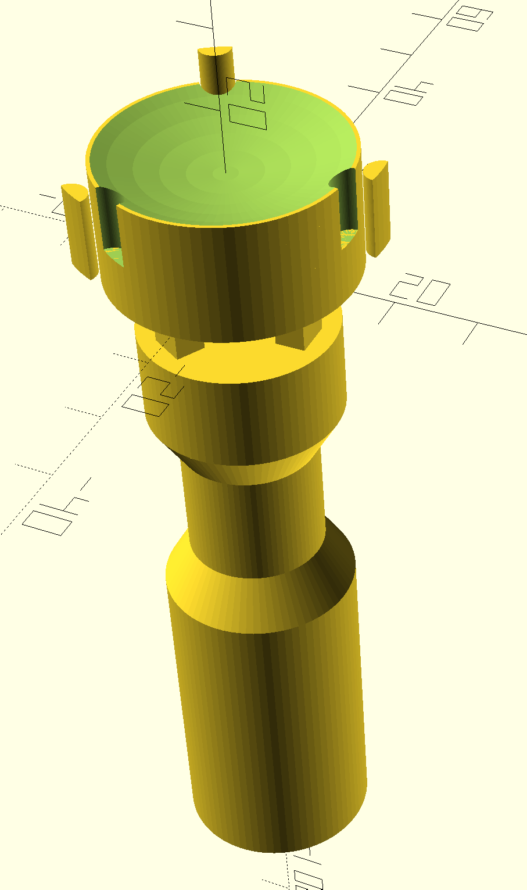
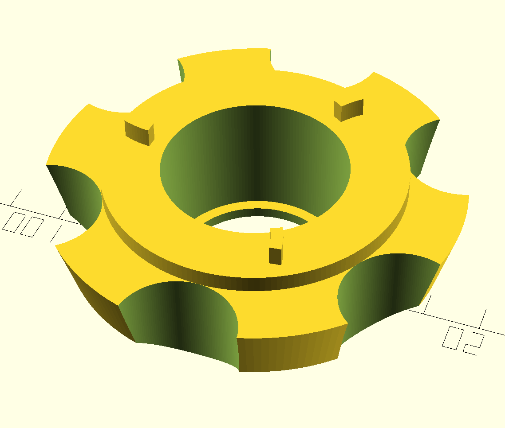

# Hayward ColorLogic Accent Light Installation & Removal Tool (3D Printed Alternative)

A 3D-printable replacement for the **Hayward SP0536CTOOL**, the manufacturer's installation and removal tool for **ColorLogic 160 and 320 accent lights**.

## Why This Exists

The original Hayward SP0536CTOOL broke during a light removal in my pool, and I didn't want to wait for a replacement. Rather than being stuck, I designed and printed my own version. This repo contains the OpenSCAD source files and ready-to-print exports for the alternative tool.

## How the Tool Works

The Hayward ColorLogic accent lights mount into standard wall fittings (such as the **SP0537** or **SP0538**) using a **compression fitting**. The tool engages the light's outer ring and twists to expand or release the mounting ring inside the wall fitting.

The tool operates in two steps:

1. **Engagement** — The tool's end piece has a set of prongs ("little legs") that align with corresponding pins on the light's outer ring.
2. **Locking/Unlocking** — By twisting the tool, you rotate a fitting that compresses an internal washer. This causes the mounting ring to expand (or contract) and lock securely into (or release from) the wall fitting.

The tool consists of two main components: the **handle** (with an interlocking end piece) and the **grip collar**.

## Light Module Reference



The face of a Hayward ColorLogic LED accent light module. Two sets of slots are visible on the outer ring:

- **Inner ring slots (3×, smaller)** — These are the notches where the **end piece prongs** engage. The tool's end piece sits over the convex lens, and its three prongs drop into these inner slots.
- **Outer ring slots (3×, short curved)** — Located on the outermost edge of the assembly, these smaller curved slots are where the **grip collar prongs** engage. The collar sits over the outer ring and its tilted arced prongs seat into these exterior slots to provide the twist leverage for locking/unlocking the light.

## Design Renders

### Handle with End Piece (Standard — Integrated Prongs)



The handle and end piece shown as a single assembly. The concave dish on top cradles the light fixture, and three integrated prongs extend from the disc edge to engage the light's outer ring. The handle features a narrowed neck section for ergonomic grip.

### Handle with End Piece (Separate Components)



The handle and end piece shown as separate printable parts. The interlocking tab system between the handle top and the disc underside is visible. The prongs here are still integrated into the end piece.

### Handle with End Piece (Separated Prongs Variant)



The improved separated prongs design. The end piece has three prong slots cut into it, and the individual prongs are printed separately alongside. This allows the prongs to be printed with layer lines running along their length for maximum inter-layer tensile strength, then epoxied into the slots.

### Grip Collar



The grip collar viewed from above. Features six gear-like teeth with semicircular cutouts for hand grip, a prong ledge ring on top with three tilted arced prongs, and a retention lip on the bottom inside edge.

## Design Variants

### Standard Model (`hayward-accent-light-installation-tool.scad`)

The original design where the prongs are printed as part of the end piece. This is a simpler assembly but suffers from a critical weakness — the prongs are prone to snapping off due to weak **inter-layer tensile strength**. Because the prongs are small features extending from the disc, FDM layer lines run perpendicular to the prong length. Forces during installation/removal try to pull layers apart (delamination), which is the weakest failure mode in FDM printing.

### Separated Prongs Model (`hayward-accent-light-installation-tool_prongs-separated.scad`)

An improved design where the prongs are **printed as separate pieces** with layer lines running along their length (longitudinally). This orients the strong axis of each layer in the direction of load, dramatically improving **inter-layer tensile strength** and resistance to delamination. The prongs are then bonded into slots in the end piece with **epoxy** (cured overnight). Some light sanding of excess epoxy may be needed after curing.

## Printing Experience & Material Testing

All prints were done on a **Bambu Lab P1S**.

| Attempt | Model | Filament | Result |
|---------|-------|----------|--------|
| 1 | Standard (integrated prongs) | ASA (similar to ABS) | **Failed** — prongs snapped off very easily |
| 2 | Standard (integrated prongs) | Nylon Carbon Fiber (**Fiberon PA612-CF**) | Significantly stronger, but still managed to break a prong during use |
| 3 | Separated prongs | Fiberon PA612-CF + epoxy assembly | **Success** — prongs oriented with layer lines lengthwise held up to the torque required for light installation/removal |

### Key Takeaway

Printing small structural features like prongs **separately** and orienting them so that layer lines run parallel to the load direction provides far superior strength compared to printing them in-place. Even a high-performance filament like Nylon CF couldn't overcome the inherent inter-layer weakness of FDM when the prongs were printed as part of the larger piece.

### Assembly Notes (Separated Prongs Model)

1. Print the end piece and individual prongs separately.
2. Apply epoxy to the prong slots and insert the prongs.
3. Allow the epoxy to cure overnight.
4. Sand off any excess epoxy.

## TODO

- [ ] **Grip collar: separated prongs variant** — The grip collar also has prongs on its ledge that could benefit from the same separated-prong treatment for added strength. I didn't break the collar during my testing (only the end piece prongs failed), so this variant hasn't been designed yet. It is likely needed for long-term durability.

## Repository Structure

```
src/
  hayward-accent-light-installation-tool.scad              # Standard model (handle, end piece, grip collar)
  hayward-accent-light-installation-tool_prongs-separated.scad  # Separated prongs variant (end piece + handle)

publication/
  hayward-accent-light-installation-tool.3mf               # Bambu Lab 3MF project file
  hayward-accent-light-installation-tool_collar.stl         # Grip collar
  hayward-accent-light-installation-tool_end.stl            # End piece (standard, integrated prongs)
  hayward-accent-light-installation-tool_end_prong.stl      # Individual prong for separated model
  hayward-accent-light-installation-tool_end_with_prong_slots.stl  # End piece with prong slots
  hayward-accent-light-installation-tool_handle.stl         # Handle
  hayward-accent-light-installation-tool_handle_short.stl   # Short handle variant
  hayward-accent-light-installation-tool_one_peice.stl      # One-piece combined end piece + handle
```

## Compatible Lights & Fittings

- **Lights:** Hayward ColorLogic 160, ColorLogic 320 accent lights
- **Wall Fittings:** Hayward SP0537, SP0538 (1.5" female pipe thread)
- **OEM Tool:** Hayward SP0536CTOOL

## License

This is a personal project shared for reference. Use at your own risk — pool equipment installation involves water-tight seals and electrical components. Verify fit and function before relying on a 3D-printed tool for permanent installations.
